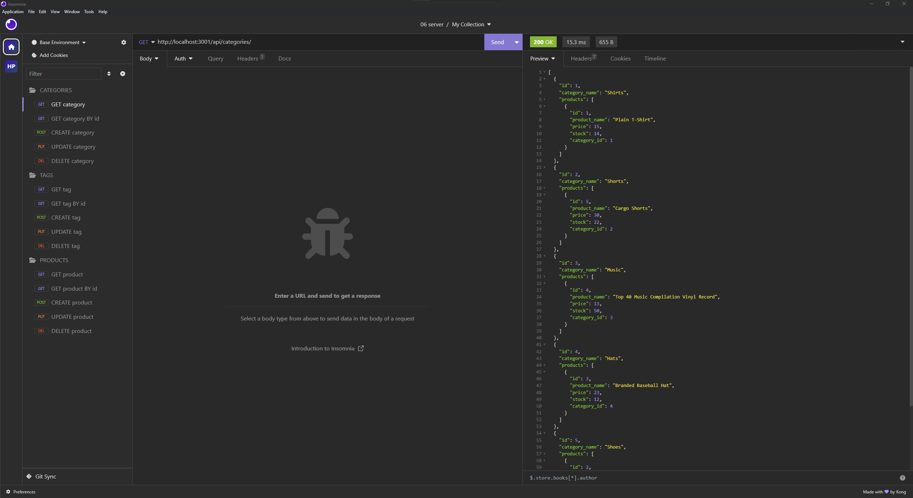

# e-commerce-back-end

## Description

This is a back-end application of a database for an e-commerce business.

The application is able to `Create`, `Read`, `Update` and `Delete` Categories, Products and Tags from the database.

## Table of Contents

- [Installation](#installation)
- [Usage](#usage)
- [Screenshot](#screenshot)
- [Walkthrough Video](#walkthrough-video)
- [Credits](#credits)
- [License](#license)


## Installation

1. Download or clone this repository
2. [node.js](https://nodejs.org/en) and [insomnia.rest](https://insomnia.rest/) is required for this application.
3. `npm i` in the terminal to install the required npm packages.
4. Create a `.env` file in the root directory with the following information:
```
DB_NAME='ecommerce_db'
DB_USER='root'
DB_PW='YOUR PASSWORD'
```
5. Create a terminal from the `schema.sql` and run the command `mysql -u root -p`
6. Enter your SQL password, then `SOURCE schema.sql;`


## Usage

1. Create a new terminal from the `server.js` file.
2. Run `npm start seed` to pull existing data from the database.
3. `npm start` to invoke the application.
3. Open the `insomnia` app and use the following table to accomplish specific operations:

|                                       | CATEGORY                                   | TAG                                  | PRODUCT                                  |
|---------------------------------------|--------------------------------------------|--------------------------------------|------------------------------------------|
| GET (ALL) or POST (CREATE)            | http://localhost:3001/api/categories/      | http://localhost:3001/api/tags/      | http://localhost:3001/api/products/      |
| GET (BY ID), PUT (UPDATE) or DELETE   | http://localhost:3001/api/categories/:id   | http://localhost:3001/api/tags/:id   | http://localhost:3001/api/products/:id   |


## Screenshot

This is an example image of the application used in insomnia.




## Walkthrough-Video

To see how this application works, follow the [Walkthrough Video](https://drive.google.com/file/d/1DEC6a5M5C0Xp-H9Kp334RiagOERxEjbS/view?usp=drive_link).


## Credits

Special thanks to [Xandromus](https://github.com/Xandromus) for providing the [starter code](https://github.com/coding-boot-camp/fantastic-umbrella).


## License

Please refer to the LICENSE in the repo.

---